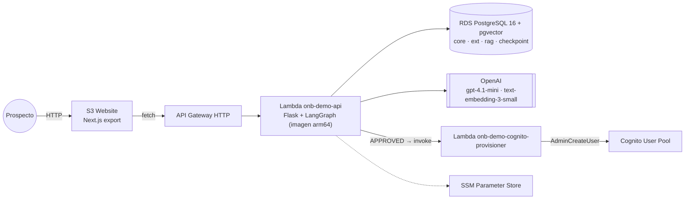
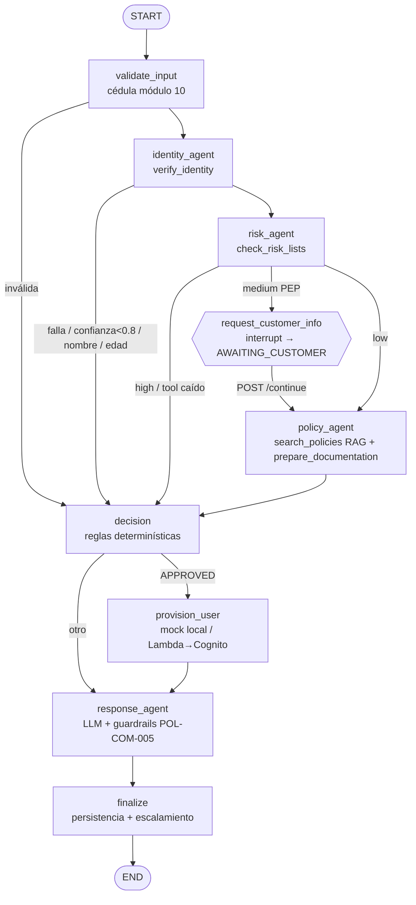

# Arquitectura

## Despliegue

En local: Next.js `:3000` → Flask `:8010` → PostgreSQL Docker `:5433`; la provisión usa un mock (`core.provisioned_user`).

## Grafo del orquestador (LangGraph)

## Principios
| Tema | Implementación |
|---|---|
| Control de tools | `ToolGate`: RAG de tools (`rag.tool_embedding`) ∩ allowlist (`core.agent_tool_permission`); fuera de la lista = `denied` auditado |
| Decisión | Reglas en código (`domain/rules.py`); el LLM interpreta y redacta, no decide umbrales |
| Estado | Checkpointer PostgreSQL (`thread_id = onboarding_id`); `interrupt()` + `Command(resume=…)` para la conversación |
| Fallas | Reintentos/timeout por tool (`core.tool`); crítico caído = `ERROR` con código específico (fail-closed); no crítico = fallback RAG |
| PII | La cédula se inyecta desde el estado: nunca llega al LLM; auditoría enmascarada (`171234****`) |
| Mensajes | Plantilla aprobada + LLM; guardrails (términos prohibidos, código, canales de ayuda); riesgo alto solo plantilla |

Módulos: `backend/app/{agents,graph,tools,rag,domain,contracts,services,api,provisioning}`.
