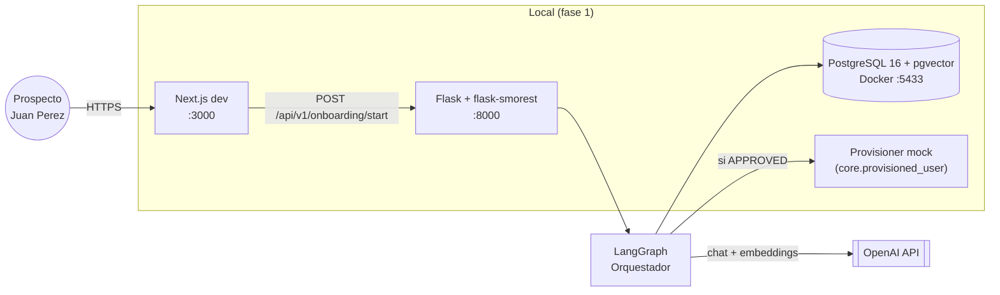
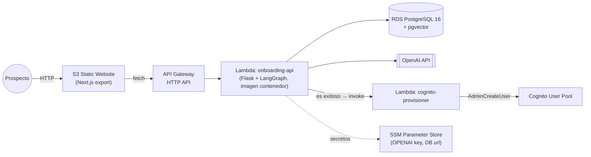
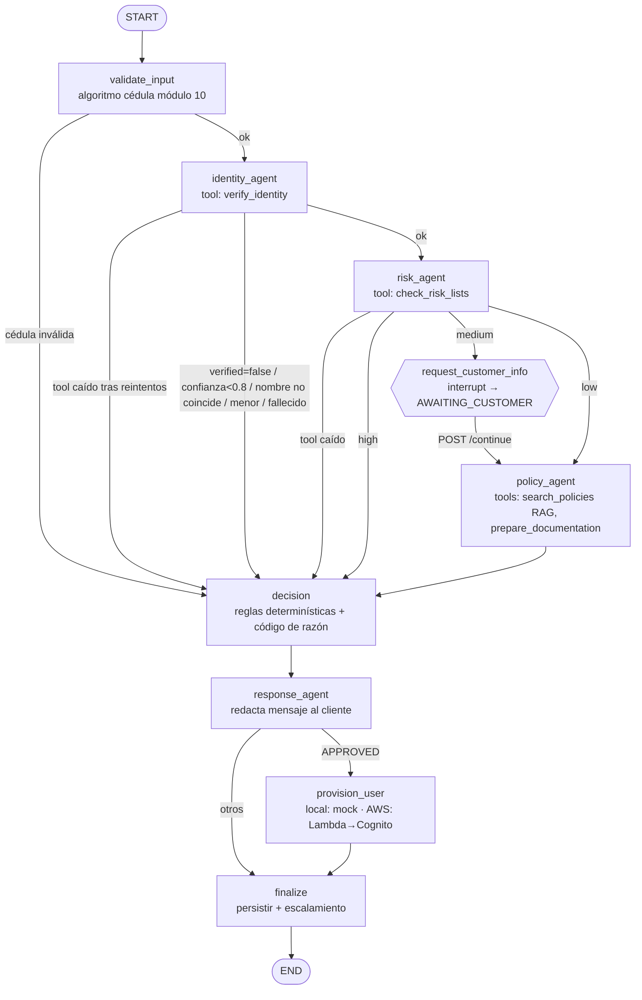
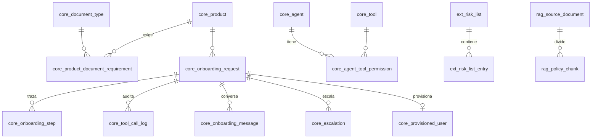

# Propuesta Técnica — Onboarding Digital Multi-Agente (PoC)

> **Estado:** borrador para revisión · **Fecha:** 2026-10-02
> Nada está construido todavía. Tras tu aprobación: (1) DDL → BD local, (2) código local, (3) AWS solo cuando lo indiques.

---

## 1. Resumen

Un **orquestador en LangGraph** coordina 4 agentes especializados (Identidad, Listas de Riesgo, Políticas, Respuesta).
Cada agente solo puede ejecutar los tools que el orquestador le permite (allowlist en BD). El estado del proceso se
persiste en PostgreSQL (checkpointer de LangGraph), lo que permite **pausar** el flujo para pedir información al
cliente y **reanudarlo** después. Las decisiones de aptitud (umbrales 0.8, riesgo `high`, edad, etc.) se evalúan con
**reglas determinísticas en código**; los LLM interpretan, buscan políticas y redactan, pero no deciden el umbral.

| Capa | Tecnología |
|---|---|
| Orquestación | LangGraph (Python 3.12) + `langgraph-checkpoint-postgres` |
| LLM | OpenAI `gpt-4.1-mini` (configurable por env `OPENAI_CHAT_MODEL`) |
| Embeddings | OpenAI `text-embedding-3-small` (1536 dims) — key validada ✅ |
| API | Flask 3 + **flask-smorest** (contratos **marshmallow** nativos + OpenAPI/Swagger automático) |
| Contratos | marshmallow 3 (API, entradas/salidas de tools, salidas de agentes) |
| Base de datos | PostgreSQL 16 + pgvector (imagen `pgvector/pgvector:pg16`) — esquemas `core`, `ext`, `rag`, `checkpoint` |
| Frontend | Next.js 15 (App Router) + React + TypeScript + Tailwind, `output: 'export'` → S3 |
| AWS (fase 2) | S3 (front) · API Gateway HTTP API · Lambda (backend) · Lambda (provisión) · Cognito User Pool · RDS PostgreSQL |
| Scripts | `manage_env.sh` (start/stop/restart/status servicios locales) · `deploy.sh` (S3) |

---

## 2. Diagrama de arquitectura

### 2.1 Despliegue (local vs AWS)





### 2.2 Grafo LangGraph (orquestador)



**Por qué secuencial y no paralelo (identidad ‖ riesgo):** si la identidad falla no tiene sentido (ni es correcto,
por minimización de datos) consultar listas de riesgo. El corto-circuito ahorra llamadas y costo de LLM.

---

## 3. Agentes, tools y control de permisos

| Agente | Responsabilidad | Tools permitidos (allowlist) | Fuente de verdad del resultado |
|---|---|---|---|
| `identity_agent` | Verificar identidad, edad, coincidencia de nombre | `verify_identity` | Salida cruda del tool + reglas |
| `risk_agent` | Consultar listas OFAC/ONU/UAFE/PEP/interna | `check_risk_lists` | Salida cruda del tool + reglas |
| `policy_agent` | Recuperar políticas aplicables y armar documentación | `search_policies`, `prepare_documentation` | Tool + citas RAG |
| `response_agent` | Redactar el mensaje al cliente | `search_policies` (filtrado a POL-COM-005) | Plantilla + few-shot + guardrails |
| orquestador | Rutea, maneja estado, reintentos, escalamiento | ninguno (no ejecuta tools de negocio) | — |

### 3.1 "RAG para saber qué tool calls usar"
1. Cada tool tiene descripción + ejemplos embebidos en `rag.tool_embedding`.
2. El agente recibe la tarea → búsqueda semántica top-3 de tools candidatos.
3. **Intersección obligatoria** con `core.agent_tool_permission` → solo esos se pasan a `llm.bind_tools(...)`.
4. Si el LLM intenta un tool fuera de la allowlist, el `ToolGate` lo bloquea, lo registra como `denied` en
   `core.tool_call_log` y no se ejecuta.
5. Guard de tools obligatorios: si el LLM "olvida" llamar `verify_identity`, el nodo lo ejecuta igual (no se confía
   en que el LLM lo decida).

> Nota honesta: con 4 tools el RAG de tools es demostrativo; su valor aparece cuando el catálogo crece.
> La seguridad la da la allowlist, no el RAG.

### 3.2 Contratos de los tools (marshmallow)

```python
# verify_identity(document_id) — respeta la firma del requisito
class VerifyIdentityOutput(Schema):
    verified   = fields.Boolean(required=True)
    confidence = fields.Float(required=True, validate=Range(0, 1))
    registry   = fields.Nested(RegistrySnapshot, allow_none=True)  # extra: nombres, fecha_nac, condición

# check_risk_lists(name, document_id)
class CheckRiskListsOutput(Schema):
    risk_level = fields.String(required=True, validate=OneOf(["low", "medium", "high"]))
    matches    = fields.List(fields.Nested(RiskMatch))             # list_code, match_type(document|name), score

# prepare_documentation(product, client_data)
class PrepareDocumentationOutput(Schema):
    product            = fields.String(required=True)
    required_documents = fields.List(fields.Nested(RequiredDocument))  # code, name, mandatory, policy_ref
```

**Lógica de los mocks (datos dummy en BD real, determinísticos):**
- `verify_identity`: busca en `ext.registro_civil`. `verified = existe AND condicion='CIUDADANO'`;
  `confidence = calidad_dato` (simula la confianza que devolvería el proveedor biométrico).
- `check_risk_lists`: match exacto por cédula **o** similitud de nombre `pg_trgm ≥ 0.85` (normalizado sin tildes);
  `risk_level` = máxima severidad de las listas con match; sin match → `low`.
- `prepare_documentation`: lee `core.product_document_requirement` filtrando por condición (`always`, `risk_medium`, `pep`).
- `ext.service_fault`: permite simular `timeout`/`error_500` por cédula para probar fallas de tools.

### 3.3 Privacidad (LOPDP Ecuador)
- La cédula **nunca se envía a OpenAI**: los tools la leen del estado del grafo (`InjectedState`); el LLM solo decide
  *qué* tool llamar. Al LLM llega `171234****` y solo el primer nombre.
- Logs y `tool_call_log.args_masked` con cédula enmascarada.
- Riesgo alto: el mensaje al cliente **no menciona listas** (prohibición de alertar al cliente / *tipping-off*).

---

## 4. Reglas de decisión y manejo de incertidumbre

Evaluadas en orden; la primera que aplica define el resultado.

| # | Condición | Status | Código | Solución propuesta / Mensaje al cliente (resumen) |
|---|---|---|---|---|
| 1 | Cédula falla algoritmo módulo 10 / provincia | `REJECTED` | `ONB-DOC-001` | "El número de cédula no es válido, verifícalo e intenta de nuevo." |
| 2 | Tool crítico no responde tras 2 reintentos | `ERROR` | `ONB-IDV-503` / `ONB-RSK-503` | "Servicio de verificación no disponible, intenta en unos minutos. Código X." (fail-closed) |
| 3 | `verified=false` (no existe / fallecido / anulada) | `ESCALATED` (agencia) | `ONB-IDV-001` | "Por políticas del banco no podemos validar tu identidad en línea; acércate a una agencia con tu cédula original." |
| 4 | `confidence < 0.8` | `ESCALATED` (agencia) | `ONB-IDV-002` | **"Por temas de políticas, debes acercarte al banco para completar tu apertura."** |
| 5 | Nombre ingresado no coincide con Registro Civil (sim < 0.6) | `ESCALATED` (agencia) | `ONB-IDV-003` | Igual que 4 (ambigüedad → presencial). |
| 6 | Edad < `product.min_age` | `REJECTED` | `ONB-IDV-004` | "Para menores de edad, acércate con tu representante legal." |
| 7 | `risk_level = high` | `ESCALATED` (cumplimiento) | `ONB-RSK-001` | Mensaje genérico: acercarse a agencia. Se abre caso a cumplimiento. |
| 8 | `risk_level = medium` (p.ej. PEP) | `AWAITING_CUSTOMER` → luego `APPROVED` | `ONB-RSK-002` | Se solicita actividad económica y origen de fondos; se agregan documentos de debida diligencia reforzada. |
| 9 | `prepare_documentation` falla (no crítico) | continúa | — | Fallback: documentos derivados del RAG, marcados `source: rag_fallback`. |
| 10 | Todo OK | `APPROVED` | `ONB-OK-000` | Bienvenida + documentos + credenciales de acceso. |
| 11 | Creación de usuario (Cognito) falla | `APPROVED_PENDING_PROVISIONING` | `ONB-PRV-503` | "Tu cuenta fue aprobada, tu acceso digital estará listo en breve." |

Reintentos: `tenacity`, backoff exponencial, `timeout_ms` y `max_retries` por tool desde `core.tool`.

---

## 5. Estado del orquestador (LangGraph)

```python
class OnboardingState(TypedDict):
    onboarding_id: str                     # = thread_id del checkpointer
    request: OnboardingInput               # prospect_name, document_id, product (validado por marshmallow)
    cedula_valid: bool
    identity: IdentityResult | None        # verified, confidence, name_match, age, condicion
    risk: RiskResult | None                # risk_level, matches
    customer_inputs: dict                  # respuestas del cliente tras interrupt (origen de fondos, actividad)
    documentation: DocumentationResult | None   # required_documents + policy_citations
    decision: Decision | None              # status, reason_code, escalation_queue, proposed_solution
    customer_message: str | None
    provisioning: ProvisioningResult | None
    errors: Annotated[list[ToolError], operator.add]
    trace: Annotated[list[StepTrace], operator.add]       # alimenta la línea de tiempo del frontend
    messages: Annotated[list[AnyMessage], add_messages]   # conversación
```

- **Checkpointer:** `PostgresSaver` en esquema `checkpoint`, `thread_id = onboarding_id`.
- **Estado conversacional:** `interrupt()` en `request_customer_info` deja el grafo pausado en BD; `POST /continue`
  hace `Command(resume=...)` sobre el mismo `thread_id`. Sobrevive reinicios del backend (y en Lambda, entre invocaciones).
- **Estado de negocio:** espejo en `core.onboarding_request`, `core.onboarding_step`, `core.onboarding_message`.

---

## 6. API (contratos marshmallow)

| Método | Ruta | Descripción | Códigos |
|---|---|---|---|
| POST | `/api/v1/onboarding/start` | Inicia y ejecuta el grafo (síncrono, ~5–10 s) | 200 resultado de negocio · 400 validación · 409 duplicado · 503 tool crítico caído |
| GET | `/api/v1/onboarding/{id}` | Estado + traza de agentes + mensajes | 200 · 404 |
| POST | `/api/v1/onboarding/{id}/continue` | Respuesta del cliente a un `AWAITING_CUSTOMER` | 200 · 404 · 409 (no está en espera) |
| GET | `/api/v1/health` | Salud (BD, OpenAI configurado) | 200 |
| GET | `/api/v1/docs` | Swagger UI (generado por flask-smorest) | — |

**Request** (exacto al requisito, `email` opcional — ver decisión D3):
```json
{"prospect_name": "Juan Perez", "document_id": "1712345675", "product": "cuenta_ahorros"}
```
Validaciones: `prospect_name` 3–160 chars, solo letras/espacios/tildes; `document_id` `^\d{10}$`; `product` ∈ catálogo activo.
(El algoritmo de cédula **no** se valida en el schema: se valida en el grafo para que quede trazado y con mensaje de negocio.)

**Response:**
```json
{
  "onboarding_id": "8b0e...",
  "status": "ESCALATED",
  "reason_code": "ONB-IDV-002",
  "customer_message": "Hola María, por temas de políticas del banco no podemos completar tu apertura en línea...",
  "proposed_solution": "Acudir a una agencia con cédula original para validación biométrica presencial.",
  "next_action": {"type": "VISIT_BRANCH"},
  "required_documents": [],
  "pending_questions": [],
  "agents_trace": [
    {"node": "validate_input", "status": "ok", "summary": "Cédula válida (módulo 10)"},
    {"node": "identity_agent", "status": "escalated", "summary": "Confianza 0.72 < 0.80"}
  ],
  "error": null,
  "created_at": "2026-10-02T16:00:00Z"
}
```
`next_action.type ∈ {LOGIN, VISIT_BRANCH, PROVIDE_INFO, RETRY_LATER, FIX_INPUT}`.

---

## 7. RAG de políticas

**Políticas a crear** (banco ficticio "Banco Andino Demo", contexto Ecuador; 5 documentos, ~2–4 páginas c/u):

| Código | Documento | Formato |
|---|---|---|
| POL-KYC-001 | Conozca a su Cliente (identidad, umbral 0.8, edad, Registro Civil) | PDF |
| POL-PLA-002 | Prevención de Lavado de Activos (listas, niveles de riesgo, PEP, debida diligencia reforzada) | PDF |
| POL-PRD-003 | Requisitos por producto (cuenta_ahorros, cuenta_corriente, deposito_plazo) | Markdown |
| POL-ESC-004 | Escalamiento y excepciones (agencia vs cumplimiento vs soporte) | Markdown |
| POL-COM-005 | Comunicación al cliente (tono, confidencialidad, LOPDP) | TXT |

Se generan PDFs (reportlab) para demostrar ingesta de PDF real (pypdf), además de md/txt.

### 7.1 Resumen de las políticas (para tu retroalimentación)

> Los umbrales que aparecen aquí son los mismos que aplican las reglas en código (sección 4). Si cambias un valor en
> la política, lo cambio también en `domain/rules.py` y en los seeds para que RAG y decisión no se contradigan.

#### POL-KYC-001 — Política "Conozca a su Cliente" (identificación y verificación) · PDF
| Art. | Contenido |
|---|---|
| 1. Objeto y alcance | Aplica a toda vinculación de personas naturales ecuatorianas por canales digitales. Extranjeros (pasaporte/cédula de extranjería) quedan fuera del canal digital → agencia. |
| 2. Documento válido | Solo cédula ecuatoriana de 10 dígitos: provincia 01–24 o 30 (ecuatorianos en el exterior), tercer dígito < 6, dígito verificador por módulo 10. Si no cumple, se rechaza sin consultar servicios externos. |
| 3. Verificación con Registro Civil | Obligatoria. El ciudadano debe constar con condición `CIUDADANO`; si consta `FALLECIDO` o `CEDULA_ANULADA` o no existe, no se vincula por canal digital. |
| 4. Nivel de confianza | La verificación debe alcanzar una confianza **≥ 0.80**. Por debajo, la vinculación digital se suspende y el cliente debe acudir a agencia para validación biométrica presencial. |
| 5. Coincidencia de nombres | El nombre declarado debe coincidir con el del Registro Civil (tolerancia a tildes, mayúsculas y nombres/apellidos parciales). Discrepancia significativa = ambigüedad → agencia. |
| 6. Edad mínima | 18 años cumplidos para productos digitales. Menores: solo en agencia, con representante legal. |
| 7. Conservación | Evidencia de verificación (resultado, fecha, confianza) se conserva 10 años. |

#### POL-PLA-002 — Prevención de Lavado de Activos y Financiamiento de Delitos · PDF
| Art. | Contenido |
|---|---|
| 1. Marco | Referencia a la Ley Orgánica de Prevención, Detección y Erradicación del Delito de Lavado de Activos y la normativa de la UAFE y la Superintendencia de Bancos (referencial, PoC). |
| 2. Listas a consultar | OFAC SDN, Consejo de Seguridad ONU, listado de la UAFE, Personas Expuestas Políticamente (PEP) del Ecuador y lista interna del banco. Consulta obligatoria **antes** de vincular. |
| 3. Criterio de coincidencia | Coincidencia exacta por cédula, o por nombre con similitud ≥ 0.85. |
| 4. Clasificación de riesgo | **Alto:** coincidencia en OFAC, ONU, UAFE o lista interna. **Medio:** PEP o familiar/colaborador cercano de PEP. **Bajo:** sin coincidencias. |
| 5. Riesgo alto | Prohibida la vinculación digital. Se reporta al Oficial de Cumplimiento. **No se informa al cliente el motivo** (prohibición de alertar). |
| 6. Riesgo medio — Debida diligencia reforzada | Se solicita al cliente: actividad económica, origen de fondos e ingresos mensuales estimados. Documentos adicionales: declaración de origen lícito de fondos y formulario PEP. Con esa información puede aprobarse, con monitoreo reforzado. |
| 7. Indisponibilidad | Si el servicio de listas no responde, **no se aprueba** (principio de fail-closed); el cliente puede reintentar. |

#### POL-PRD-003 — Requisitos por producto · Markdown
| Producto | Edad | Canal digital | Documentos (siempre) | Adicionales riesgo medio / PEP |
|---|---|---|---|---|
| `cuenta_ahorros` | 18+ | Sí | Cédula, planilla de servicio básico (≤ 3 meses), aceptación de términos y condiciones, formulario KYC | Declaración de origen de fondos, formulario PEP |
| `cuenta_corriente` | 18+ | Sí | Lo de ahorros + referencia bancaria o comercial + registro de firma digital | Ídem + certificado de ingresos |
| `deposito_plazo` | 18+ | Sí | Cédula, formulario KYC, declaración de origen de fondos (siempre, por monto) | Formulario PEP |

Incluye: monto mínimo de apertura referencial, tarifas no aplican (PoC) y que productos no listados no se ofrecen digitalmente.

#### POL-ESC-004 — Escalamiento y excepciones · Markdown
| Situación | Cola | Solución propuesta al cliente | SLA |
|---|---|---|---|
| Identidad no verificada, confianza < 0.80, nombres no coinciden, fallecido/anulada | `agencia` | Acercarse a cualquier agencia con cédula original para validación biométrica | Atención inmediata en agencia |
| Riesgo alto | `cumplimiento` | Mensaje genérico de acercarse a agencia (sin detalle) | 48 h revisión del Oficial de Cumplimiento |
| Riesgo medio sin información completa | — (espera al cliente) | Completar el formulario en línea; la solicitud expira a los 7 días | — |
| Falla técnica de un servicio crítico | `soporte_ti` | Reintentar en unos minutos; se entrega código de error | 4 h |
| Falla al crear acceso digital tras aprobación | `soporte_ti` | Cuenta aprobada; acceso habilitado en breve | 24 h |

Principio: ante duda o ambigüedad, el canal digital **nunca aprueba**; propone la vía alternativa más cercana.

#### POL-COM-005 — Comunicación con el cliente · TXT
- Tono cordial, tuteo, español neutro ecuatoriano; dirigirse por el **primer nombre**.
- Mensajes breves (≤ 120 palabras), con: resultado, motivo comprensible, siguiente paso concreto y, si aplica, código de referencia.
- Nunca mencionar listas de riesgo, sanciones, ni datos de terceros; nunca culpar al cliente.
- En rechazos/escalamientos usar la frase institucional: *"por temas de políticas del banco"*.
- No mostrar la cédula completa (solo últimos 4 dígitos) — Ley Orgánica de Protección de Datos Personales.
- Incluir canal de ayuda: línea de atención y agencias.

**Pipeline:**
1. **Ingesta:** pypdf / lectura de texto → normalización → `sha256` (re-ingesta idempotente).
2. **Chunking híbrido: estructural → semántico + encabezado contextual** (ver 7.2 para la justificación):
   - Nivel 1 estructural: corte por artículos/encabezados (`Art. N`, `##`) → `section_path`
     (ej. `POL-PLA-002 > Art. 4 > Clasificación de riesgo`).
   - Nivel 2 semántico (solo si la sección > 450 tokens): embedding por oración, distancia coseno entre oraciones
     consecutivas, corte donde supera el percentil 90; chunks < 60 tokens se fusionan con el vecino.
   - Tablas: un chunk por fila, repitiendo el encabezado.
   - Encabezado contextual: se embebe `"{título} | {section_path}\n{texto}"`; en `content` se guarda el texto limpio.
   - Sin overlap: los cortes caen en límites con significado; el overlap solo duplicaría resultados en el top-k.
3. **Embeddings:** `text-embedding-3-small`, en lotes; se guarda en `rag.policy_chunk.embedding vector(1536)`.
4. **Recuperación:** coseno (`<=>`), índice **IVFFLAT** creado después de la carga:
   - `lists = 10` (≈ √N para N≈100–150 chunks; la regla `N/1000` de pgvector aplica a tablas grandes).
   - `SET LOCAL ivfflat.probes = 3` (≈ √lists).
   - Filtro previo por `metadata` (producto/tema) + `top_k = 4` + umbral de similitud mínimo 0.30.
   - Script `rag/eval_recall.py`: compara recall@4 IVFFLAT vs scan exacto sobre ~15 preguntas de prueba y reporta
     el valor elegido de `probes` (evidencia del ajuste del parámetro).

Volumen estimado: ~120 chunks → costo de embeddings < US$0.01.

### 7.2 Justificación del chunking

| Motivo | Explicación |
|---|---|
| Las políticas son normativas | Cada artículo es una unidad (condición → umbral → consecuencia). Un corte de tamaño fijo puede separar "confianza ≥ 0.80" de "debe acudir a agencia", y el agente queda con media regla. |
| Solo semántico ignora estructura explícita | Puede fusionar el final del Art. 3 con el inicio del Art. 4 si son similares; respetar artículos da cortes auditables. |
| Hay artículos multi-tema | POL-PLA-002 Art. 4 define riesgo alto/medio/bajo; la consulta "PEP" debe traer solo el bloque de riesgo medio → nivel semántico. |
| Trazabilidad | El agente cita `section_path` en cada documento requerido (`policy_ref`); en banca toda decisión debe justificarse. |
| Encabezado contextual | "se solicitará la declaración" no significa nada aislado; con el encabezado su vector queda cerca de consultas de PEP/riesgo medio. |
| IVFFLAT | Chunks coherentes producen clusters más compactos → mejor recall con pocos `probes`. |

**Costos/riesgos:** embeddings por oración (~1.500, < US$0.01); se cachean por `sha256` para que la re-ingesta sea
determinística; el percentil 90 se valida empíricamente.

**Evaluación (`rag/eval_recall.py`):** 15 preguntas con chunk esperado. Compara **chunking fijo (500/50) vs híbrido**
y **IVFFLAT vs scan exacto**, reportando recall@4, MRR y "regla completa" (el chunk recuperado contiene condición y
consecuencia).

---

## 8. Agente de respuesta ("fine-tuning con los datos de los otros agentes")

Propuesta para la PoC:
- **Fase 1 (incluida):** structured output + few-shot dinámico desde `core.response_example` filtrado por
  `reason_code` + fragmentos de POL-COM-005 recuperados por RAG. Guardrails: el mensaje se valida con marshmallow,
  y en riesgo alto se usa plantilla fija (sin LLM libre).
- **Fase 2 (opcional):** exportar `core.response_example` + trazas reales a JSONL y lanzar un fine-tuning en OpenAI
  (`gpt-4.1-mini`). Un fine-tuning con ~20 ejemplos no aporta frente a few-shot y agrega tiempo/costo; por eso lo
  dejo como opcional (ver decisión D2).

---

## 9. Modelo de datos (DDL)

Archivo completo: [`db/ddl/001_schema.sql`](../../db/ddl/001_schema.sql) — **no ejecutado, pendiente de tu aprobación.**



| Esquema | Tablas | Propósito |
|---|---|---|
| `core` | product, document_type, product_document_requirement, agent, tool, agent_tool_permission, onboarding_request, onboarding_step, tool_call_log, onboarding_message, escalation, provisioned_user, response_example | Negocio, permisos, auditoría |
| `ext` | registro_civil, risk_list, risk_list_entry, service_fault | Mocks de sistemas externos (datos dummy reales en BD) |
| `rag` | source_document, policy_chunk (vector 1536 + IVFFLAT coseno), tool_embedding, retrieval_log | RAG de políticas y de tools |
| `checkpoint` | (las crea LangGraph) | Estado del grafo / conversación |

Decisiones de diseño relevantes:
- Índice único parcial `(document_id, product_code)` sobre estados activos/aprobados → evita duplicados (HTTP 409).
- `rag` no tiene FKs hacia `core` (referencias lógicas) para mantener los esquemas desacoplados.
- `ext` es solo lectura para el rol de la app.
- `normalize_name()` inmutable (unaccent + lower) para índice trigram en nombres de listas.

---

## 10. Usuarios de prueba (resultado conocido)

Todas las cédulas cumplen el algoritmo módulo 10, salvo la #2 (a propósito).

| # | Nombre | Cédula | Producto | Resultado esperado | Código | Mensaje al usuario (resumen) |
|---|---|---|---|---|---|---|
| 1 | Juan Perez | 1712345675 | cuenta_ahorros | ✅ APPROVED + usuario Cognito | ONB-OK-000 | Bienvenida, documentos, acceso |
| 2 | Juan Perez | **1712345678** | cuenta_ahorros | ❌ REJECTED | ONB-DOC-001 | Cédula inválida |
| 3 | Maria Fernanda Loor | 0918765439 | cuenta_ahorros | ⚠️ ESCALATED (confianza 0.72) | ONB-IDV-002 | **Por políticas, acérquese al banco** |
| 4 | Luis Ortega | 0104567896 | cuenta_ahorros | ⚠️ ESCALATED (no existe en R.C.) | ONB-IDV-001 | Acérquese a agencia |
| 5 | Carlos Andrade | 1709988776 | cuenta_ahorros | ⚠️ ESCALATED cumplimiento (riesgo high) | ONB-RSK-001 | Mensaje genérico, acérquese |
| 6 | Patricia Salazar | 1805566773 | cuenta_corriente | ⏸️ AWAITING_CUSTOMER (PEP, medium) → APPROVED | ONB-RSK-002 | Pide origen de fondos → aprueba con docs extra |
| 7 | Mateo Cedeño | 1302244668 | cuenta_ahorros | ❌ REJECTED (17 años) | ONB-IDV-004 | Acérquese con representante legal |
| 8 | Rosa Vera | 1107788992 | cuenta_ahorros | ⚠️ ESCALATED (FALLECIDO en R.C.) | ONB-IDV-001 | Acérquese a agencia |
| 9 | Diego Paredes | 0603344557 | cuenta_ahorros | 🔴 ERROR (Registro Civil timeout) | ONB-IDV-503 | Servicio no disponible, reintente |
| 10 | Sofia Mena | 1711122232 | cuenta_ahorros | 🔴 ERROR (listas de riesgo caídas) | ONB-RSK-503 | Servicio no disponible, reintente |
| 11 | Pedro Gomez | 0922233341 | cuenta_ahorros | ⚠️ ESCALATED (cédula de "Ana Villacís") | ONB-IDV-003 | Acérquese a agencia |
| 12 | Juan Perez (2.º intento) | 1712345675 | cuenta_ahorros | 409 duplicado | ONB-DUP-409 | Ya tienes una solicitud/cuenta |
| 13 | cualquiera | 1712345675 | `tarjeta_oro` | 400 validación marshmallow | ONB-VAL-400 | Producto no disponible |

> ⚠️ **Hallazgo:** la cédula del ejemplo del enunciado, `1712345678`, **no es válida** (su dígito verificador
> correcto es 5 → `1712345675`). La uso como caso de rechazo y uso `1712345675` para el caso feliz.

---

## 11. Estructura del repositorio

```
prueba-tecnica/
├── manage_env.sh            # start|stop|restart|status|logs <svc>|db:init|db:seed|rag:ingest|db:reset
├── deploy.sh                # --initial | --update | --destroy  (bucket S3 website)
├── docker-compose.yml       # pgvector/pgvector:pg16 en :5433 (no choca con tu otro postgres :5432)
├── .env.example             # OPENAI_API_KEY, DATABASE_URL, OPENAI_CHAT_MODEL, PROVISIONER=local|lambda
├── docs/                    # esta propuesta + diagramas (.mmd y .drawio)
├── db/ddl/001_schema.sql    # DDL
├── db/seeds/                # catálogos, agentes/tools/permisos, registro_civil, listas, fallas, ejemplos
├── policies/                # políticas fuente (pdf, md, txt) + generador de PDFs
├── backend/
│   ├── pyproject.toml       # uv, Python 3.12
│   ├── app/
│   │   ├── api/             # blueprints flask-smorest
│   │   ├── contracts/       # schemas marshmallow (API, tools, agentes)
│   │   ├── graph/           # state.py, builder.py, routing.py, nodes/
│   │   ├── agents/          # base (ToolGate), identity, risk, policy, response
│   │   ├── tools/           # verify_identity, check_risk_lists, prepare_documentation, search_policies
│   │   ├── rag/             # ingest, chunking semántico, embeddings, retriever, tool_retriever, eval_recall
│   │   ├── domain/          # cedula.py (módulo 10), rules.py (decisión), error_codes.py
│   │   ├── provisioning/    # local_mock.py, lambda_invoker.py
│   │   └── db/
│   ├── lambda_handler.py    # adaptador API Gateway → Flask (apig-wsgi)
│   └── tests/               # pytest: cédula, reglas, 13 escenarios end-to-end
├── lambdas/cognito_provisioner/handler.py
├── infra/aws.sh             # --create | --destroy : Cognito, Lambdas, API GW, RDS, SSM
└── frontend/                # Next.js: formulario, línea de tiempo de agentes, formulario de "continuar", login Cognito
```

**Frontend:** `/` formulario (nombre, cédula con validación en vivo, producto) · `/onboarding?id=` resultado + línea de
tiempo de agentes + formulario de información adicional cuando aplica · `/login` (solo en AWS) para probar que el usuario
Cognito creado realmente puede autenticarse. Se usa query param en vez de ruta dinámica porque `output: 'export'` no
admite rutas dinámicas sin pre-generar.

---

## 12. Fase AWS (solo cuando lo autorices)

1. RDS PostgreSQL 16 (`db.t4g.micro`) + `CREATE EXTENSION vector` + DDL + seeds + ingesta RAG.
2. SSM Parameter Store: `OPENAI_API_KEY`, `DATABASE_URL` (SecureString).
3. Cognito User Pool `onboarding-demo-pool` + App Client (sin secreto, para el front).
4. Lambda `cognito-provisioner` (Python): `AdminCreateUser` (username = cédula, atributos `name`, `custom:product`).
5. Lambda `onboarding-api` (imagen contenedor en ECR, timeout 60 s, 1024 MB) + API Gateway HTTP API con CORS al bucket.
6. `deploy.sh --initial` → bucket S3 website con el build de Next.js.
7. Prueba de los 13 usuarios contra AWS y entrega de la tabla con resultados reales.

Costo estimado mensual mientras esté encendido: RDS ~US$13–15; Lambda/API GW/Cognito/S3 ≈ US$0–1 a este volumen.
`infra/aws.sh --destroy` y `deploy.sh --destroy` lo eliminan todo.

---

## 13. Decisiones que necesito que confirmes o cambies

| ID | Decisión | Mi recomendación | Alternativa |
|---|---|---|---|
| D1 | Framework API | **Flask + flask-smorest** (marshmallow es nativo, Swagger gratis) | FastAPI validando con marshmallow a mano (choca con Pydantic) |
| D2 | Agente de respuesta | **Few-shot + RAG + guardrails** ahora; fine-tuning como fase 2 opcional | Fine-tuning real en OpenAI desde ya |
| D3 | Credenciales Cognito | Agregar `email` **opcional** al request: si viene, Cognito envía la invitación; si no, en modo demo se muestra la contraseña temporal en pantalla | Solo contraseña temporal en pantalla, sin email |
| D4 | Red en AWS | **Lambda fuera de VPC + RDS público con SG restringido + SSL obligatorio** (PoC, sin NAT ~US$32/mes) | Lambda en VPC + NAT Gateway (más seguro, más caro) |
| D5 | IaC | **Bash + AWS CLI** (`infra/aws.sh`, mismo estilo que tu `deploy.sh`) | AWS SAM / CDK |
| D6 | Región y perfil AWS | `us-east-1`, perfil `default` (cuenta 728429206846) | La que indiques |
| D7 | LLM de los agentes | `gpt-4.1-mini` (rápido/barato, buen tool-calling) | `gpt-4.1` |

## 14. Próximos pasos tras tu aprobación
1. Ajustar propuesta/DDL según tus comentarios.
2. Levantar PostgreSQL local (`manage_env.sh start db`) → ejecutar DDL + seeds.
3. Generar políticas → ingesta RAG con tu API key (ya validada) → `eval_recall.py`.
4. Backend (grafo + agentes + tools + API) con tests de los 13 escenarios.
5. Frontend Next.js + `manage_env.sh` completo.
6. Esperar tu "sí" para AWS.

---

## 15. Ajustes durante la implementación (2026-10-02)

| Tema | Propuesta | Implementado | Motivo |
|---|---|---|---|
| Chunking | tope 450 / mínimo 60 tokens, corte por oraciones | tope 220 / mínimo 40, corte por **párrafos** (oraciones con ventana solo si un párrafo excede) | Los artículos miden 100–300 tokens: con 450 el nivel semántico nunca actuaba; por oraciones, las etiquetas ("Riesgo alto.") desplazaban los cortes |
| Volumen RAG | ~120 chunks, `lists = 10` | 43 chunks, `lists = √N = 7`, `probes = 3` | Corpus real más pequeño |
| Orden del grafo | response → provision | **provision → response** | El mensaje debe saber si el usuario se creó (ONB-PRV-503) |
| Códigos | — | + `ONB-OK-001` (aprobado tras debida diligencia), `ONB-PRV-503` probado con usuario #15, #14 (documentación vía RAG) | Cubrir todos los caminos de falla |
| Puerto API local | 8000 | 8010 | 8000 ocupado en la máquina |
| Seguridad RDS | SG restringido | 5432 abierto + SSL + clave 32 chars | Lambda fuera de VPC no tiene IP fija (aceptado para la PoC) |
